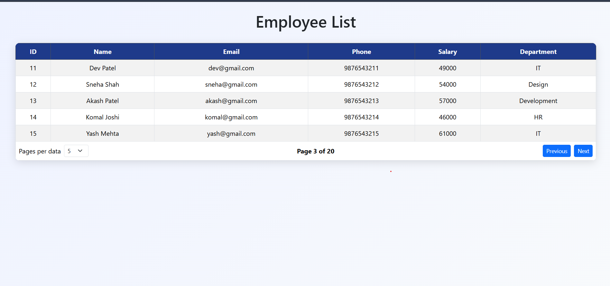

## 👩‍💻 Employee Data Table

A simple and responsive **Employee Data Table** built using **React JS, Bootstrap, CSS, and JSON Server**.

This project displays employee information in a table and includes **pagination, rows per page selection, Previous/Next buttons, and API data fetching**.

## 🚀 Features

- 📋 Display Employee Data
- 🔄 Fetch Data using Fetch API
- 📄 Pagination
- 🔢 Rows per Page Selection
- ⬅️ Previous Button
- ➡️ Next Button
- 🎨 Bootstrap Table Styling
- 💻 Responsive Design
- 🌐 JSON Server API
- ✨ Hover Effect

##  ## 🛠️ Technologies Used

- ⚛️ React JS
- 🟦 Bootstrap
- 🟨 JavaScript
- 🎨 CSS3
- 🔗 Fetch API
- 🌐 JSON Server

## 📂 Project Structure

employee-table
   -  src
      - App.jsx
      -  App.css
      - main.jsx
    
    -  db.json
    - README.md

## 🖼️ Images

## 🎦Video

https://drive.google.com/file/d/1Gb9PZDekWi-SrEay-YXOyfSIIsp1Tkrv/view?usp=sharing
